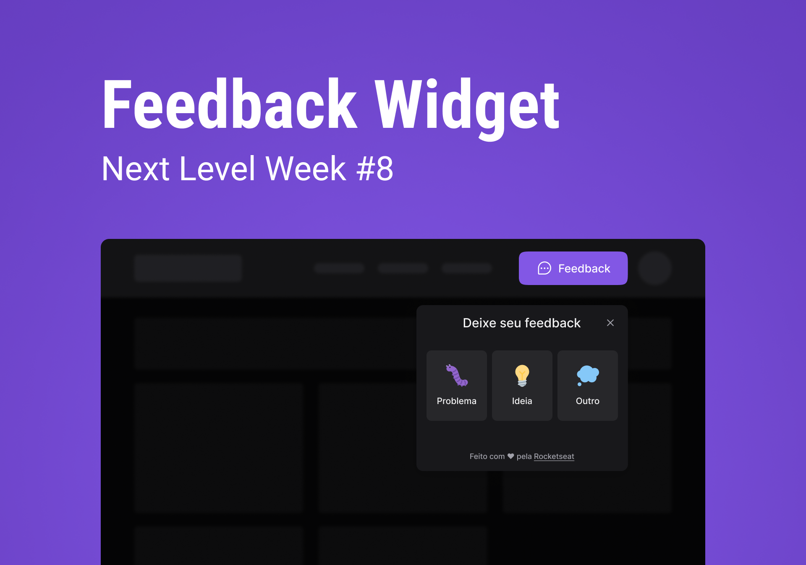

<h1 align="center">
  NLW Return Server API
</h1>

<p align="center">
  <a href="#-projeto">Sobre o Projeto</a> •
  <a href="#-guia-de-instalação-e-execução">Guia de instalação</a> •
  <a href="#-tecnologias">Tecnologias</a>
</p>

<p align="center">
  
</p>

## 👩‍💻 Projeto

API pública disponibilizada no [Railway](https://railway.app/) para registro de feedbacks onde os mesmos podem ser do tipo Problema, Ideia ou Outro.

## 📚 Guia de instalação e execução

### Requisitos:

- [Git](https://git-scm.com/)
- [Node.js](https://nodejs.org/pt-br/)

```bash
# Clone este projeto
$ git clone https://github.com/vagnereix/nlw-return-server.git

# Acesse
$ cd nlw-return-server

# Instale as dependências
$ npm i

# Rode o projeto
npm run dev
```

Pronto! Você pode acessar os endpoints através do endereço http://localhost:3000/endpoint

## 🚀 Tecnologias

- [Prisma](https://www.prisma.io/)
- [NodeJS](https://nodejs.org/en/)
- [TypeScript](https://www.typescriptlang.org/)
- [Jest](https://jestjs.io/pt-BR/)

##

<p align="center">
Feito com 💜&nbsp;e ☕&nbsp;por <a href="https://github.com/vagnereix">Vagner Reis</a>
</p>
